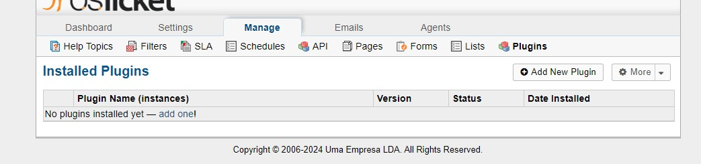

# Radar Details Plugin for osTicket

## Introduction
This plugin is designed to extend the functionalities of osTicket, enabling the integration of specific radar details into forms within the osTicket system.

## Installation
### Preparation
Download and extract the plugin file.

### File Placement
Move the extracted folder to the osTicket plugin directory, located at `<path_to_osTicket>/include/plugins`.

## Plugin Installation via Admin Panel
### Admin Panel Access
Access `Admin Panel > Manage > Plugins`.

### Installation
Select the 'Radar Details' plugin from the list and choose the `Install` option.

### Activation
Activate the plugin only after complete configuration to avoid conflicts.

## Instance Configuration
### Deactivation Before Configuration
Deactivate the plugin before adjusting the settings of any instance if it was already active.

### Accessing Instances
In the `Instances` menu, add and configure new instances as needed.

Change the status of the instance to `Active`.

### Specific Settings
Adjust the settings according to the needs, including the selection of forms and activation of data backup.

### Saving Changes
After making the changes, confirm them using the `Save Changes` button.

### Activation
After saving the changes, activate the plugin to ensure that the new configurations take effect.

### Future Modifications
Subsequent changes to the settings of the chosen form may require deactivating the instance, removing it, and creating a new one.

## Uninstallation

### Plugin Uninstallation
To uninstall the entire plugin:
1. If the plugin is active, deactivate it first by navigating to `Admin Panel > Manage > Plugins` and using the deactivate option.
2. After deactivation, you can safely remove the plugin from the `Plugins` list.

### Instance Uninstallation
To remove a specific instance:
1. If the plugin is active, deactivate it first.
2. Navigate to the `Instances` menu.
3. Select the instance you wish to remove and use the remove option.

By following these steps, you can ensure that the plugin or its instances are correctly removed without leaving residual data or configurations.
